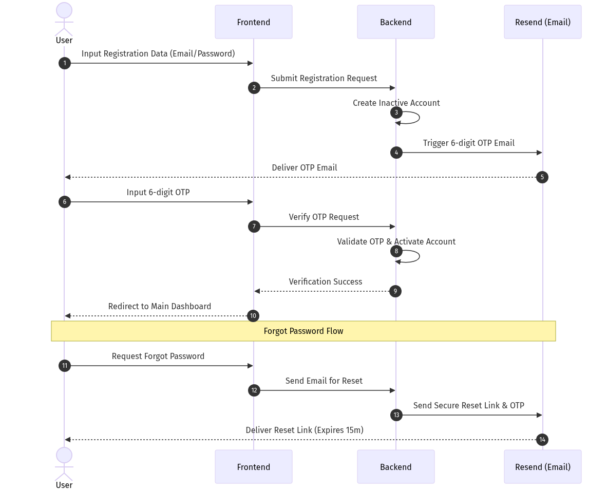
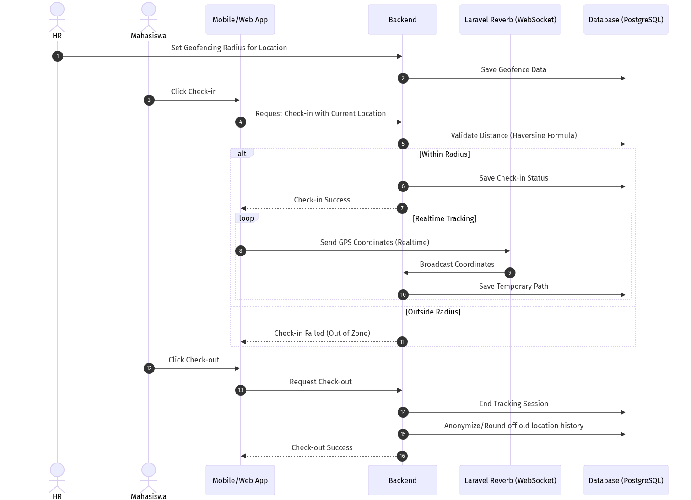
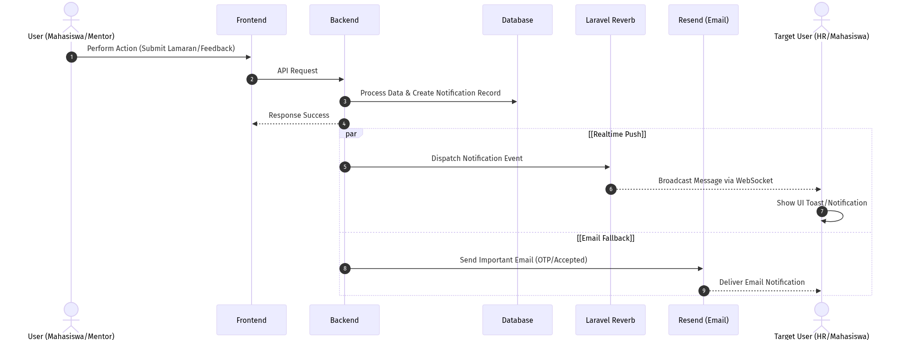

# Sequence Diagrams - InternHub

Berikut adalah gambar Sequence Diagram berdasarkan alur bisnis utama pada dokumentasi proyek. Anda dapat melihat pratinjau gambar di bawah ini, atau mengunduh file `.png` secara langsung dari folder `docs/`.

## 1. Authentication Flow
Menjelaskan alur Registrasi, Login, OTP (Resend), dan fitur Lupa Password.

## 2. Realtime Location Attendance
Menjelaskan alur Absensi Geofencing, Check-in, Check-out, dan Realtime Tracking (Laravel Reverb & PostgreSQL Haversine).

## 3. Realtime Notification
Menjelaskan alur Notifikasi, WebSockets (Reverb), dan Email Fallback (Resend) ketika ada kejadian penting seperti lamaran atau feedback.

